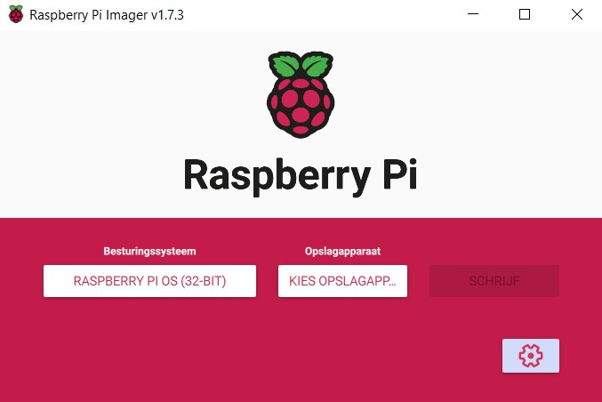

# Installation Guide

## Table of Contents

- [BOM (Bill of Materials)](#bom-bill-of-materials)
- [Installation](#installation)
  - [Step 1: Install Raspberry Pi OS](#step-1-install-raspberry-pi-os)
  - [Step 2: Enable VNC](#step-2-enable-vnc)
  - [Step 3: Clone the git repository](#step-3-clone-the-git-repository)
  - [Step 4: Install the required packages](#step-4-install-the-required-packages)
  - [Step 5: Run the code](#step-5-run-the-code)
  - [Step 6: Change the Effect with MQTT Explorer](#step-6-change-the-effect-with-mqtt-explorer)
  - [Step 7: Make the program run on boot (optional)](#step-7-make-the-program-run-on-boot-optional)

## BOM (Bill of Materials)

| Description | Quantity | Price |
|---|---|---|
| Geluidssensor | 1 | [€0.99](https://www.otronic.nl/nl/geluidssensor-module-voor-arduino.html?source=googlebase&gclid=CjwKCAjw6p-oBhAYEiwAgg2PgvJGbAdSLS3JsDfqUBgOOat_ftWyWaGPusD0NC0eCy59e2G_c6wvgRoCTzEQAvD_BwE) |
|SK6812 5V LED | 2m | [€23](https://www.amazon.nl/BTF-LIGHTING-Vergelijkbare-Individueel-Adresseerbare-Niet-Waterdicht/dp/B01N2PC9KK?th=1&psc=1) |
| Stekkeradapter 5V 10A 50W| 1 | [€21.99](https://www.amazon.nl/Transformatoren-AC100-240V-Omvormer-Stekkeradapter-Verlichting/dp/B07PBNCFDG?th=1) |
| Adapter omvormer | 1 | [€9.02](https://www.amazon.nl/Poppstar-Adapter-5x2-Connectors-CCTV-camera/dp/B084RHH8LC/ref=sr_1_34?__mk_nl_NL=%C3%85M%C3%85%C5%BD%C3%95%C3%91&crid=V9PER2XBYZ4R&keywords=adapter%2Bto%2Bdc%2Bconnector%2B5.5mm%2Bx%2B2.5mm&qid=1696238739&sprefix=adapter%2Bto%2Bdc%2Bconnector%2B5.5mm%2Bx%2B2.5mm%2Caps%2C59&sr=8-34&th=1) |
| 3Pin Connector | 1 | [€9.99](https://www.amazon.nl/HUAZIZ-vrouwelijk-mannelijke-vrouwelijke-elektrische/dp/B0BPP87N9G/ref=sr_1_5?crid=11ONOETG871I1&keywords=3+pin+connector&qid=1696237070&sprefix=3+pin+connec%2Caps%2C281&sr=8-5) |
|Raspberry Pi |1|[€86.17](https://www.amazon.nl/Raspberry-Pi-ARM-Cortex-A72-Bluetooth-Micro-HDMI/dp/B07TC2BK1X/ref=sr_1_6?crid=UVXPOXO03958&keywords=raspberry%2Bpi%2B4&qid=1696238540&sprefix=raspberyr%2Caps%2C434&sr=8-6&th=1)|
|USB Microfoon|1|[€7.11](https://www.amazon.nl/Audio-opnemen-USB-microfoon-omnidirectioneel-Skype-chatten/dp/B08BFHSLGV/ref=sr_1_5?__mk_nl_NL=%C3%85M%C3%85%C5%BD%C3%95%C3%91&crid=2LOMGXB9RSJ61&keywords=fasient%2BUSB-pc-microfoon&qid=1697532932&sprefix=fasient%2Busb-pc-microfoon%2Caps%2C160&sr=8-5&th=1)|
| 3D printing | 1 | €4 (voorbehouden) |

Totaal: €158.27 (exclusief 3D print)

## Installation

### Step 1: Install Raspberry Pi OS

Firstly, you are going to need to install Raspberry Pi OS on your Raspberry Pi.

You can start by downloading the Raspberry Pi Imager from the [Raspberry Pi website](https://www.raspberrypi.org/software/).

Once you have downloaded the Raspberry Pi Imager, you can open it and select the Raspberry Pi OS (32-bit) option.



Next, you will need to select the SD card you want to install Raspberry Pi OS on. Make sure you have selected the correct SD card, as the Raspberry Pi Imager will format the SD card.

### Step 2: Enable VNC

Once you have installed Raspberry Pi OS on your Raspberry Pi, you will need to enable VNC so you can access the Raspberry Pi remotely.

To enable VNC, you will need to open the Raspberry Pi Configuration tool. You can do this by opening the terminal and typing `sudo raspi-config`. Once you have opened the Raspberry Pi Configuration tool, you will need to navigate to the `Interface Options` menu. In this menu, you will need to select the `VNC` option and enable it.

You can also use the graphical desktop to enable VNC. To do this, you will need to open the `Raspberry Pi Configuration` tool from the `Preferences` menu. Once you have opened the `Raspberry Pi Configuration` tool, you will need to navigate to the `Interfaces` tab. In this tab, you will need to select the `VNC` option and enable it.

When you have enabled VNC on the Raspberry Pi, you will need to install the VNC Viewer on your computer. You can download the VNC Viewer from the [RealVNC website](https://www.realvnc.com/en/connect/download/viewer/).

### Step 3: Clone the git repository

To run our code on the Raspberry Pi, you will need to clone our git repository. You can do this by opening the terminal and installing git with the following command:

```bash
sudo apt install git
```

Once you have installed git, you can clone our git repository with the following command:

```bash
git clone https://github.com/vives-project-xp/DancingLight.git
```

### Step 4: Install the required packages

To successfully run our code, you will need to install the required packages. You can do this by opening the terminal and navigating to the `DancingLight` directory. Once you are in the `DancingLight` directory, you can install the required packages with the following command:

```bash

```

### Step 5: Run the code

To run our code, you will need to open the terminal and navigate to the `DancingLight` directory. Once you are in the `DancingLight` directory, you can run the code with the following command:

```bash
python3 main.py
```

### Step 6: Change the Effect with MQTT Explorer

To change the effect, you will need to install MQTT Explorer on your computer. You can download MQTT Explorer from the [MQTT Explorer website](http://mqtt-explorer.com/).

### Step 7: Make the program run on boot (optional)

To make the project plug and play, you can make the program run on boot. You will first need to change the ALSA Sound Driver a bit. You can do this by opening the terminal and typing the following command:

```bash
sudo nano /etc/asound.conf
```

Then you will need to paste the following code in the file:

```bash

pcm.!default {
  type asym
  capture.pcm "mic"
}
pcm.mic {
  type plug
  slave {
    pcm "hw:1,0"
  }
}
```

Do the same for the file /home/pi/.asoundrc

```bash
sudo nano /home/pi/.asoundrc
```
The last change you need to make is adding this line to:

```bash
/etc/modprobe.d/alsa-base.conf
```

```bash
options snd slots=snd-bcm2835,snd-usb-audio,vc4,vc4
```

If you still encounter some issues you can try to install these packages:

```bash
sudo apt-get install libportaudio0 libportaudio2 libportaudiocpp0 portaudio19-dev
```

To make the program run on boot, you will need to run the script in rc.local

```bash
sudo nano /etc/rc.local
```

Add the following line before the exit 0 line:

```bash
sudo python3 /home/pi/DancingLight/main.py &
```

Add this line before the exit 0 line.

Hopefully, the program will now run on boot and you can enjoy the project!