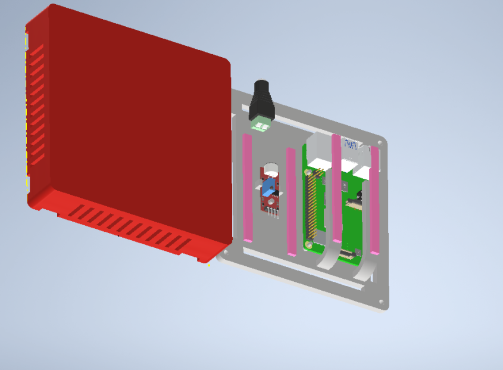
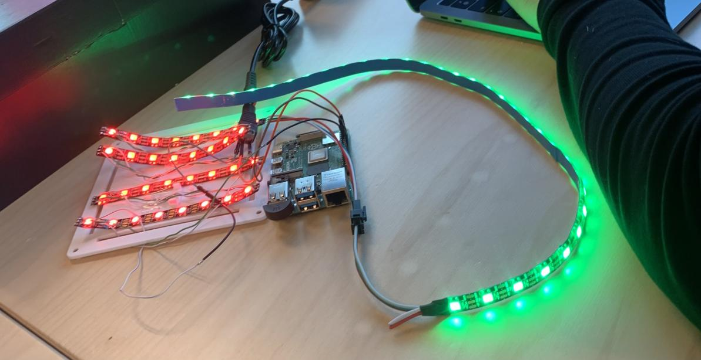

# Dancing Light

## Content

<ul>
    <li>Introduction</li>
    <li>Project explained</li>
    <li>Hardware</li>
    <li>Software</li>
    <li>Who does what?</li>
    <li>Future changes</li>
    <li>Bill Of Materials</li>
    <li>Sources</li>
    <li>License and author info</li>
</ul>

## Introduction
## Project explained

The dancing light project will make LED's react to music.

We will be working with a sound sensor which will send a signal depending on the strength of the sound/music. Using a Raspberry Pi 4 we can code a program to make this happen. We used VNC for most of our programming (more info in software)
.
The project will have a few modes. Some generic effects will be added into a program. Lastly the mode which listens to audio input will also be implemented into the project. We use a USB mic to listen to the audio due to the rasberry only being able to take in digital input on the gpio pins. With this mic we can connect it to a USB port on the rasberry and make a program which can observe analog input. This way we can visualize sound strength, frequencies and other sound related variables. With the analog way we can only display light for the on and off state.

Taking the entire casing into a count it exists out of four different parts. The lid has some holes for air circulation and the top is printed very thin, just so the light of the LEDs is visible from the outside. At the sides a system was added to connect two cases with each other. It uses an external part to connect the sides. To ensure the same lighting in each box, we decided to add the rasberry to the back of the main box. This will make it so the main box will be coming forward when compared to the other boxes when connected to for example a wall. Originally we used to parts which would bridge over the rasberry to provide light all over the box, but this caused the issue that you could visually see the LED's on one side and only the light on the other side. 

## Effects
1. Audioreact
2. Rainbow
3. Twolights

## Hardware

Our projects requires the following hardware and materials to be constructed (links included in BOM):

1. Raspberry Pi 4
 

2. Stekkeradapter 5V 10A
 

3. Adapter -> DC
 

4. 3Pin Connector
 

5. Ledstrip 5V
 

6. Geluidssensor
 

7. Casing 3D print

## Software

1. [VNC Viewer](https://www.realvnc.com/en/connect/download/viewer/):

This is the software we used to program the Raspberry Pi 4. It's easy to set up after installing. An advantage of this software is the ability to work on the same project at the same time. Whenever one person changes something all other members see the changes on their own device live.

&nbsp;

2. Python coding environment:

VNC viewer has the ability to write code in the program itself, opening the right type of file in your folder.
 

## Who does/did what?

- ### Global (entire group)

1. Project defining (What's expected from the project)
2. Project design (Brainstorming about options, designing connection system for multiple products)
3. Material list (Searching cheapest solutions while mantaining quality)
4. Github issues
5. Group meetings

- ### Mirko (Software & ai + Scrum master)

1. Software testing (Making a LED strip function as we want with the rasberry pi 4)
2. Searching code
3. MQTT
4. Issue management

- ### Seraphin (Software & ai)

1. Software testing (Making a LED strip function as we want with the rasberry pi 4)
2. Searching code
3. Rasberry configuration

- ### William (Software & ai)

1. Poster design
2. Presentation

- ### Elias (Netwerken)

1. Looking for power supply solution
2. Case design
3. Rasberry configuration
4. Solderen

- ### Esteban (Software & ai)

1. Case design
2. README documentation
3. Searching code
4. Coding to read mp3 file (and sound based effects)

- ### To be determined

1. Testing product (week 7-10)/
    - Software and hardware
    - Casing (does the connection between two products work?)
        1. Top of first case was printed to thick (no light could pass)
2. Optimizing product:
    - Thinner top layer
    - Rasberry added to the back of the case
3. Document finalization:
    - README
    - Powerpoint final presentation
    - ...
4. Preparing final presentation
5. Coding:
    - LED's on sound strength
    - Template lighting for LED's (Done)
6. Case connection (important)

## Future changes
1. Adding more boxes
2. ...

## BOM

| Description | Quantity | Price |
|---|---|---|
| Geluidssensor | 1 | [€0.99](https://www.otronic.nl/nl/geluidssensor-module-voor-arduino.html?source=googlebase&gclid=CjwKCAjw6p-oBhAYEiwAgg2PgvJGbAdSLS3JsDfqUBgOOat_ftWyWaGPusD0NC0eCy59e2G_c6wvgRoCTzEQAvD_BwE) |
|SK6812 5V LED | 2m | [€23](https://www.amazon.nl/BTF-LIGHTING-Vergelijkbare-Individueel-Adresseerbare-Niet-Waterdicht/dp/B01N2PC9KK?th=1&psc=1) |
| Stekkeradapter 5V 10A 50W| 1 | [€21.99](https://www.amazon.nl/Transformatoren-AC100-240V-Omvormer-Stekkeradapter-Verlichting/dp/B07PBNCFDG?th=1) |
| Adapter omvormer | 1 | [€9.02](https://www.amazon.nl/Poppstar-Adapter-5x2-Connectors-CCTV-camera/dp/B084RHH8LC/ref=sr_1_34?__mk_nl_NL=%C3%85M%C3%85%C5%BD%C3%95%C3%91&crid=V9PER2XBYZ4R&keywords=adapter%2Bto%2Bdc%2Bconnector%2B5.5mm%2Bx%2B2.5mm&qid=1696238739&sprefix=adapter%2Bto%2Bdc%2Bconnector%2B5.5mm%2Bx%2B2.5mm%2Caps%2C59&sr=8-34&th=1) |
| 3Pin Connector | 1 | [€9.99](https://www.amazon.nl/HUAZIZ-vrouwelijk-mannelijke-vrouwelijke-elektrische/dp/B0BPP87N9G/ref=sr_1_5?crid=11ONOETG871I1&keywords=3+pin+connector&qid=1696237070&sprefix=3+pin+connec%2Caps%2C281&sr=8-5) |
|Raspberry Pi |1|[€86.17](https://www.amazon.nl/Raspberry-Pi-ARM-Cortex-A72-Bluetooth-Micro-HDMI/dp/B07TC2BK1X/ref=sr_1_6?crid=UVXPOXO03958&keywords=raspberry%2Bpi%2B4&qid=1696238540&sprefix=raspberyr%2Caps%2C434&sr=8-6&th=1)|
| 3D printing | / | €4 (voorbehouden) |

Totaal: €151.16

## Sources
Github: https://github.com/vives-project-xp/DancingLight

## License and author info

Made by Mirko Sinnaeve, Seraphin Sampers, William Rogov, Elias Vanthorre en Esteban Desmedt in 2023-2024, semester 1 for VIVES.
