# Dancing Light

## Content

- [Project explained](#project-explained)
- [Effects](#effects)
- [Hardware](#hardware)
- [Software](#software)
- [Who does/did what?](#who-doesdid-what)
- [Planning](#planning)
- [Future changes](#future-changes)
- [BOM](#bom)
- [Links](#links)
- [License and author info](#license-and-author-info)

## Project explained

The Dancing Light project will make LED's react to music.

We will be working with a sound sensor which will send a signal depending on the strength of the sound/music. Using a Raspberry Pi 4 we can code a program to make this happen. We used VNC for most of our programming (more info in software).

The project will have a few modes. Some generic effects will be added into a program. Lastly the mode which listens to audio input will also be implemented into the project. We use a USB mic to listen to the audio due to the Raspberry Pi only being able to take in digital input on the GPIO pins.

With this mic we can connect it to a USB port on the Pi and make a program which can observe analog input. This way we can visualize sound strength, frequencies and other sound related variables. With the digital pin reading (old mic) way we can only display light for the on and off state.

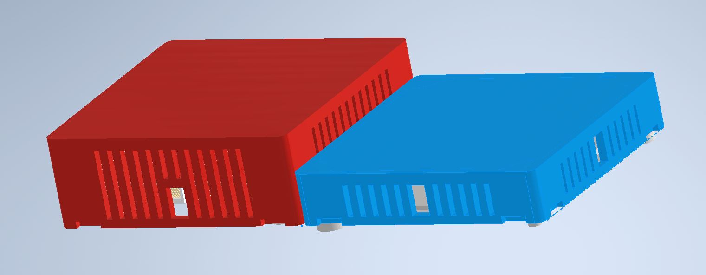
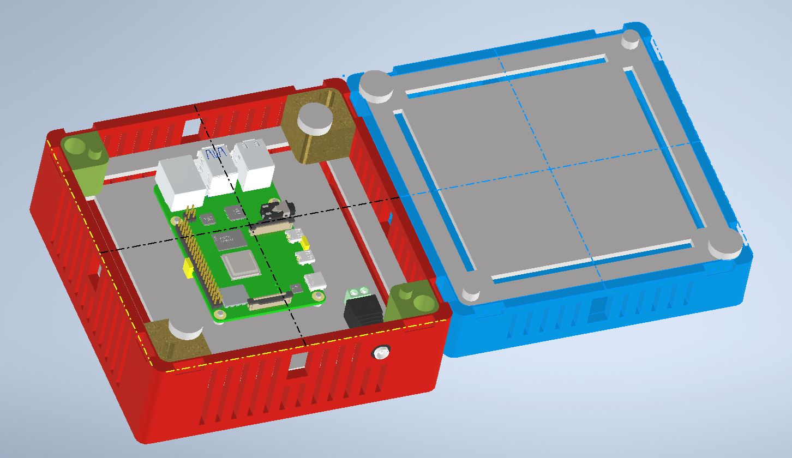

Taking the entire casing into account it exists out of four different parts. The lid has some holes for air circulation and the top is printed very thin, just so the light of the LEDs is visible from the outside.

At the sides a system was added to connect two cases with each other. It uses an external part to connect the sides. To ensure the same lighting in each box, we decided to add the Pi to the back of the main box. This will make it so the main box will be coming forward when compared to the other boxes when connected to for example a wall.

Originally we used two parts which would bridge over the Pi to provide light all over the box, but this caused the issue that you could visually see the LED's on one side and only the light on the other side.

## Effects
These are the effects supported with the MQTT broker
1. "MiddenBounce"
2. "uitbreidReactie"
3. "vlakMuziek"
4. "ledsMeDb"
5. "ledsMeDbRGB"
6. "allLights"
7. "bubbelKleur"
8. "off"
9. "rainbow"
10. "rgbKleur" (define the rbg value)

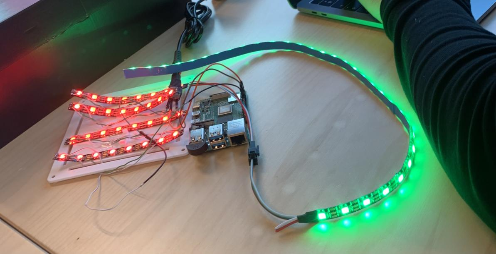

## Hardware

Our project requires the following hardware and materials to be constructed (links and pricing included in BOM list):

### 1. Raspberry Pi 4

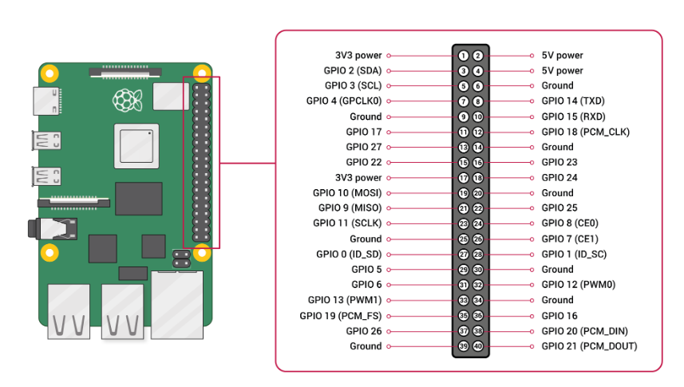

We use a Raspberry Pi 4 to power and drive our project, this is a powerful way in which we can include many different effects.

### 2. Plug adapter 5V 10A

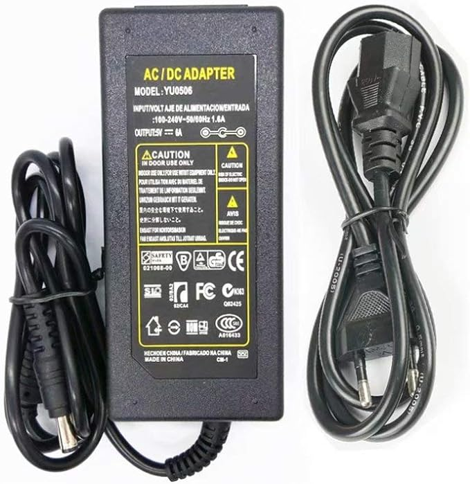

Of course the Raspberry Pi 4 needs power to work, for that we use this adapter.

### 3. Adapter -> DC

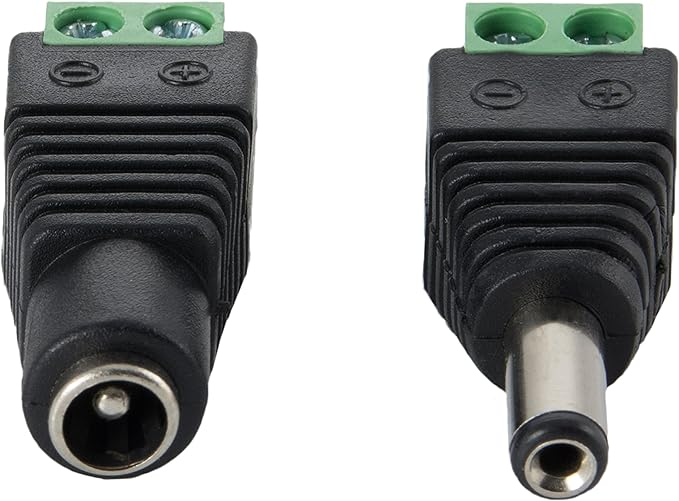

### 4. 3 Pin Connector

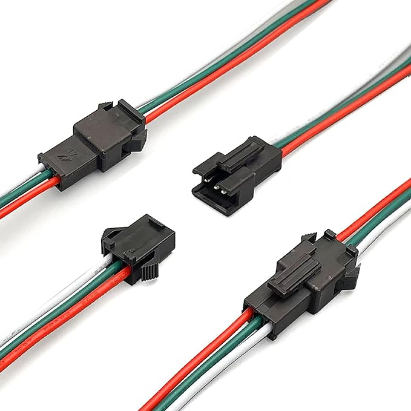

To connect LED strips we use these connectors, which can easily connect LED strips to eachother by just plugging one end into another. 

### 5. LED strip 5V

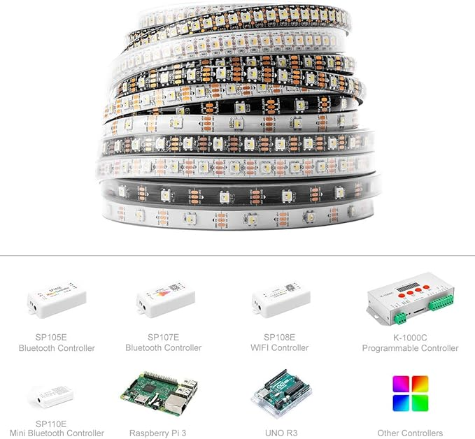

### 6. Sound sensor

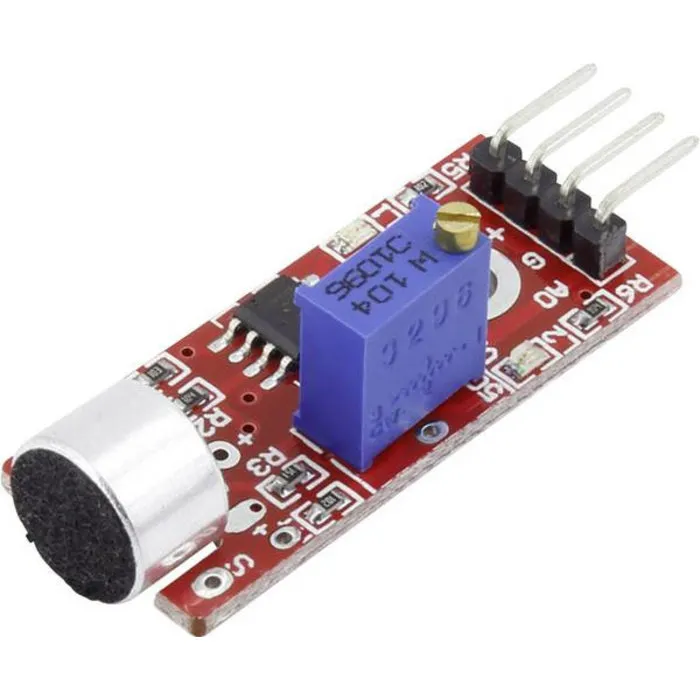

Dropped due to low sensitivity, could also only be connected to digital GPIO pins. This way we had to work with a specific value to work around and can also only play an effect when this value is exceeded.

### 7. USB microphone

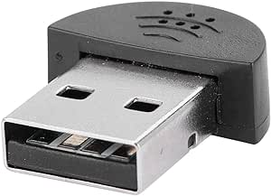

We chose to use a different approach by using this USB-mic to be able to take in analog input to create effects based on the strength of the sound. With some calculations found online we can determine the decibel rate of the sound. This mic is way more sensitive to sound, even lighting up from silent sounds far away (depending on the chosen value of course).

### 8. Casing 3D prints

## Software

### 1. [VNC Viewer](https://www.realvnc.com/en/connect/download/viewer/):

This is the software we used to program the Raspberry Pi 4. It's easy to set up after installing. An advantage of this software is the ability to work on the same project at the same time. Whenever one person changes something all other members see the changes on their own device live.

&nbsp;

### 2. Python coding environment

VNC viewer has the ability to write code in the program itself, opening the right type of file in your folder.

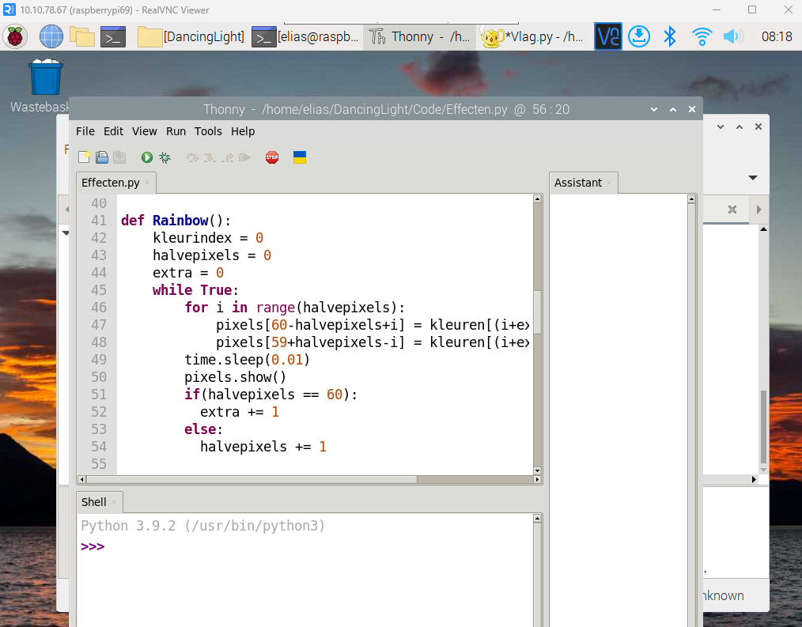

### 3. MQTT with [Project Master](https://github.com/vives-project-xp/ProjectMaster)

MQTT gives us the ability to connect with the Project Master. Which makes it possible to send the effects from a central device to the different projects.

### 4. [Autodesk Inventor Professional 2021](https://www.autodesk.com/products/inventor/overview?term=1-YEAR&tab=subscription)

Inventor gives the ability to make 3D designs for making this project possible. This program also makes it easy to convert the 3D designs to STL files for 3D printing.

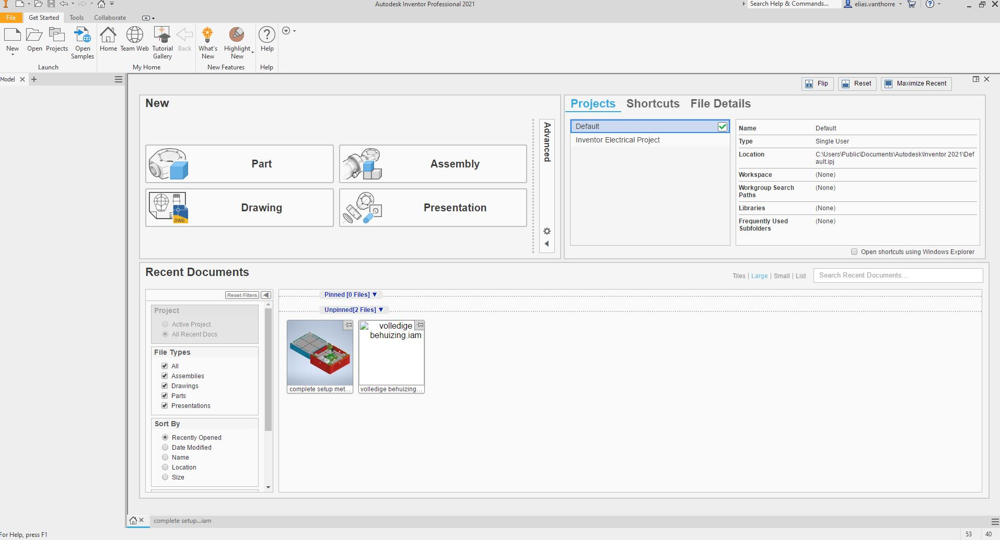

## How is the box build?
WARNING: When picking the project up from the amgnet board you need to be carefull to not pull it off to quick. And brake the project also the boxes are connect with clips so be carefull when pulling the different boxes apart. 

To disasemble the setup you first need to pull the boxes apart and pull out the clips inbetween of the two boxes.
Secondly you screw off the magnets who are inserted in to the standoffs on both boxes. When the magnets are of you will be able to pull of the lid from the smaller box and you will see the leds. For the bigger boxs you will need to first screw off the spacers out of the biggerbox. These screws are pretty thight so be carefull when unscrewing them. When alle the spacer are unscrewed you will be able to pull of the lid from the bigger box with the pi and wires still attage. For the ease of use you can disconnect the wires going to the pi to get a look in the bigger box. Everything is power by the famel plug and this one is glued in place so be carefull when pulling out the lid. 

## Who does/did what?

- ### Global (entire group)

1. Project defining (What's expected from the project)
2. Project design (Brainstorming about options, designing connection system for multiple products)
3. Material list (Searching cheapest solutions while maintaining quality)
4. Github issues
5. Group meetings

- ### Mirko (Software & ai + Scrum master)

1. Software testing (Making a LED strip function like we want with the Raspberry Pi 4)
2. Searching code
3. Issue management
4. MQTT
5. Coding effects

- ### Seraphin (Software & ai)

1. Software testing (Making a LED strip function like we want with the Raspberry Pi 4)
2. Searching code
3. Rasberry configuration
4. MQTT
5. Coding effects
6. Sound detection on raspberry pi 4

- ### William (Software & ai)

1. Poster design
2. Presentation
3. Searching code for the microphones
4. Integrating hardware to the Raspberry Pi.

- ### Elias (Networks)

1. Looking for power supply solution
2. Case design
3. Rasberry configuration
4. Soldering
5. Assembly
6. README documentation
7. README 3D

- ### Esteban (Software & ai)

1. README documentation
2. Searching code
3. Coding to read mp3 file (and sound based effects)
4. Sound coding
5. Coding effects

- ### Planning

1. Testing product (week 7-10)/
    - Software and hardware
    - Casing (does the connection between two products work?)
        1. Top of first case was printed to thick (no light could pass)
        2. Do we use plastic or do we 3D print see trough layer.
2. Optimizing product:
    - Thinner top layer
    - Raspberry Pi added to the back of the case
3. Coding:
    - LED's on sound strength
    - Template lighting for LED's (Done)
4. Case connection (important)
5. MQTT connection (Project master)
6. Document finalization:
    - README
    - Powerpoint final presentation
    - Manage files on Pi
7. Preparing final presentation

## Future changes

1. Adding better solution for connecting the different boxes.
2. More effects

## BOM

| Description | Quantity | Price |
|---|---|---|
| Geluidssensor | 1 | [€0.99](https://www.otronic.nl/nl/geluidssensor-module-voor-arduino.html?source=googlebase&gclid=CjwKCAjw6p-oBhAYEiwAgg2PgvJGbAdSLS3JsDfqUBgOOat_ftWyWaGPusD0NC0eCy59e2G_c6wvgRoCTzEQAvD_BwE) |
|SK6812 5V LED | 2m | [€23](https://www.amazon.nl/BTF-LIGHTING-Vergelijkbare-Individueel-Adresseerbare-Niet-Waterdicht/dp/B01N2PC9KK?th=1&psc=1) |
| Stekkeradapter 5V 10A 50W| 1 | [€21.99](https://www.amazon.nl/Transformatoren-AC100-240V-Omvormer-Stekkeradapter-Verlichting/dp/B07PBNCFDG?th=1) |
| Adapter omvormer | 1 | [€9.02](https://www.amazon.nl/Poppstar-Adapter-5x2-Connectors-CCTV-camera/dp/B084RHH8LC/ref=sr_1_34?__mk_nl_NL=%C3%85M%C3%85%C5%BD%C3%95%C3%91&crid=V9PER2XBYZ4R&keywords=adapter%2Bto%2Bdc%2Bconnector%2B5.5mm%2Bx%2B2.5mm&qid=1696238739&sprefix=adapter%2Bto%2Bdc%2Bconnector%2B5.5mm%2Bx%2B2.5mm%2Caps%2C59&sr=8-34&th=1) |
| 3Pin Connector | 1 | [€9.99](https://www.amazon.nl/HUAZIZ-vrouwelijk-mannelijke-vrouwelijke-elektrische/dp/B0BPP87N9G/ref=sr_1_5?crid=11ONOETG871I1&keywords=3+pin+connector&qid=1696237070&sprefix=3+pin+connec%2Caps%2C281&sr=8-5) |
|Raspberry Pi |1|[€86.17](https://www.amazon.nl/Raspberry-Pi-ARM-Cortex-A72-Bluetooth-Micro-HDMI/dp/B07TC2BK1X/ref=sr_1_6?crid=UVXPOXO03958&keywords=raspberry%2Bpi%2B4&qid=1696238540&sprefix=raspberyr%2Caps%2C434&sr=8-6&th=1)|
|USB Microfoon|1|[€7.11](https://www.amazon.nl/Audio-opnemen-USB-microfoon-omnidirectioneel-Skype-chatten/dp/B08BFHSLGV/ref=sr_1_5?__mk_nl_NL=%C3%85M%C3%85%C5%BD%C3%95%C3%91&crid=2LOMGXB9RSJ61&keywords=fasient%2BUSB-pc-microfoon&qid=1697532932&sprefix=fasient%2Busb-pc-microfoon%2Caps%2C160&sr=8-5&th=1)|
| 3D printing | 1 | €4 (reserved) |

Total: €158.27 (3D printing excluded)

## Links

Github: https://github.com/vives-project-xp/DancingLight

## License and author info

Made by Mirko Sinnaeve, Seraphin Sampers, William Rogov, Elias Vanthorre en Esteban Desmedt in 2023-2024, semester 1 for VIVES.
